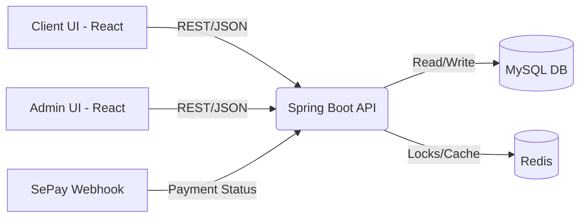

<div align="center">
  
  <h1>🎬 WebPhim - Cinema Booking System</h1>
  <p>Hệ thống đặt vé xem phim trực tuyến hiện đại với đầy đủ tính năng phân quyền (Admin & Client).</p>
  
  
  
  
</div>

<hr/>

## 📖 Introduction

**WebPhim** là một nền tảng quản lý rạp chiếu phim tổng thể và đặt vé trực tuyến. Hệ thống cho phép người dùng (Client) duyệt phim, xem lịch chiếu, chọn ghế realtime theo hàng/cột và thanh toán tự động qua SePay webhook. Đối với ban quản trị (Admin), hệ thống cung cấp trang quản lý các nguồn lực rạp chiếu như sơ đồ phòng chiếu, phim, suất chiếu và thống kê hóa đơn nhanh chóng.

---

## 🚀 Tech Stack

### 💅 Frontend (Client & Admin)

- **Framework:** ReactJS 19 (thông qua Vite build tool).
- **Routing:** React Router DOM (v7).
- **Styling:** CSS & Tailwind CSS (nếu có).
- **Networking:** Axios.
- **Architecture:** Component-based Architecture, phân chia Layout theo Role.

### ⚙️ Backend (RESTful API)

- **Framework:** Java Spring Boot 3 + Maven.
- **Security:** Spring Security + JSON Web Token (JWT) cho Authentication/Authorization.
- **ORM:** Spring Data JPA + Hibernate.

### 🗄️ Database & Caching

- **Primary Database:** MySQL - Quản lý quan hệ dữ liệu (Relational data).
- **Caching & Concurrency:** Redis (Redisson) - Distributed Lock để xử lý race_condition khi nhiều user cùng book chung một ghế.

### 🔧 Tools & Deployment

- **Containerization:** Docker & Docker Compose.
- **Testing:** Postman (API Testing & Webhook Test), JUnit.
- **Payment Gateway:** Tích hợp Webhook SePay xử lý thanh toán tự động.

---

## ✨ Key Features

1. **Authentication & Role-Based Access Control (RBAC):**
   - Đăng ký, đăng nhập an toàn bằng JWT.
   - Phân quyền rõ ràng: `ADMIN`, `STAFF` và `CUSTOMER`.
2. **Movie & Showtime Browsing:**
   - Danh sách phim đang chiếu / sắp chiếu, chi tiết phim (trailer, poster).
   - Tra cứu suất chiếu theo ngày/giờ và rạp.
3. **Interactive Seat Selection:**
   - Vẽ giao diện sơ đồ ghế ngồi trực quan (ghế trống, đang chọn, đã bán).
   - Xử lý lock ghế realtime trong quá trình thanh toán bằng Redis để chống double-booking.
4. **Automated Payment Integration:**
   - Hệ thống Orders linh hoạt tích hợp SePay webhook để xác nhận thanh toán ngân hàng tự động.
5. **Admin Dashboard:**
   - Quản lý toàn diện: Movies, Rooms (Rạp), Seats (Ghế), Showtimes (Suất chiếu), Analytics.

---

## 🏛️ System Architecture

Hệ thống được thiết kế theo hướng **Decoupled Architecture** (Frontend SPA tách biệt với Backend API RESTful).
Client và Admin SPA giao tiếp qua HTTPS với Spring Boot Backend sử dụng kiến trúc Controllers -> Services -> Repositories. Redis hỗ trợ giảm tải cache và quản lý Distributed Lock cho nghiệp vụ đặt ghế.



_(Ghi chú: Nếu Markdown viewer của bạn hỗ trợ mermaid diagram, sơ đồ trên sẽ được render tự động)_

---

## 🛡️ Security & Workflow Audit (Backend)

Dựa trên các tiêu chuẩn **OWASP 2025** (bởi `security-auditor`) và **System Architecture Patterns** (bởi `backend-specialist`), dưới đây là đánh giá chi tiết về luồng nghiệp vụ (Workflow) và bảo mật (Security) hiện tại của hệ thống API Spring Boot:

### ✅ Điểm mạnh (Strengths)

1. **Concurrency Control (Distributed Lock):** Xử lý Race Condition khi đặt ghế xuất sắc nhờ việc áp dụng `RedissonClient.getLock()` với cơ chế TTL (1-2s). Tránh hoàn toàn tình trạng Double-Booking (bán 1 ghế cho 2 người) khi traffic cao. Tuân thủ tuyệt đối kiến trúc Backend phân tán.
2. **Two-Phase Booking Verification:** Hệ thống double-check trạng thái ghế ở cả **Database** (JPA) và **Cache** (Redis) trước khi khóa ghế. Cơ chế Fail-fast này giúp tiết kiệm I/O.
3. **Decoupled Payment Workflow:** Không phụ thuộc vào phản hồi từ Frontend để cập nhật trạng thái đơn hàng. Sử dụng **SePay Webhook Callback** giúp luồng thanh toán hoạt động độc lập, đảm bảo tính toàn vẹn dữ liệu ngay cả khi client mất kết nối mạng (drop connection) giữa chừng.
4. **Graceful Error Handling:** Trong Webhook, mọi ngoại lệ đều được return `Http 400 Bad Request`, điều này kích hoạt cơ chế tự động Retry của hệ thống webhook SePay. Các khóa Redis (RLock) cũng được nhả (unlock) an toàn tuyệt đối trong block `finally`.
5. **Sessionless (JWT) & Password Hashing:** Dùng `SessionCreationPolicy.STATELESS` kèm mã hóa `BCryptPasswordEncoder` đảm bảo tuân thủ tiêu chuẩn về REST API và chống lại tấn công Rainbow Table.

### ⚠️ Điểm cần cải thiện (Areas for Improvement / Vulnerabilities)

1. **CSRF Vulnerability do Cookie-based JWT (A01 / A05 - OWASP):**
   - **Hiện tại:** Mặc dù tắt CSRF (`http.csrf().disable()`), nhưng `JwtAuthenticationFilter` lại đọc token JWT từ vị trí **HTTPOnly Cookie** (`"jwt"`).
   - **Rủi ro:** Khi sử dụng Cookie làm phương tiện xác thực, nếu bạn không cấu hình `SameSite=Strict/Lax`, hệ thống dễ dàng bị tấn công rò rỉ hoặc mạo danh thông qua **Cross-Site Request Forgery (CSRF)** từ một tab trình duyệt khác của kẻ xấu. Hơn nữa, dòng lệnh `cors.addAllowedOriginPattern("*")` kèm `setAllowCredentials(true)` là một nguy cơ cực lớn trên Production.
   - **Hướng khắc phục:** Cần thiết lập `SameSite=Strict` khi khởi tạo cookie ở AuthController, và chỉ định rõ danh sách Whitelist CORS cụ thể (ví dụ: chỉ cho phép `https://beecinema.vn`).

2. **Insecure Direct Object Reference (IDOR) nguy cơ cao (A01 - OWASP):**
   - **Hiện tại:** Endpoint `/api/payment/status/**` đang mở public không yêu cầu Token xác thực. Đồng thời mã đơn hàng `orderCode` được sinh bằng `System.currentTimeMillis()`.
   - **Rủi ro:** Mã Timestamp rất dễ bị Brute-force/đoán trước (Guessable ID). Attacker có thể viết vòng lặp cào (scraping) API này để xem lén trạng thái đơn hàng của tất cả khách hàng khác.
   - **Hướng khắc phục:** Thay mã `orderCode` bằng **UUIDv4** (Random string không thể đoán trước) hoặc yêu cầu Bearer JWT khi tra cứu thông tin status.

3. **Insecure Webhook Authentication (A02 - OWASP):**
   - **Hiện tại:** Mã Secret Key của SePay Webhook được đối chiếu dạng "bao hàm" (`!authorization.contains(sepaySecretKey)`).
   - **Rủi ro:** Lỗ hổng Logic Authentication. Kẻ xấu có thể gửi một Payload rác có chứa chỉ một phần chuỗi giống SecretKey nhằm đánh lừa hệ thống pass qua bộ lọc Bypass.
   - **Hướng khắc phục:** Phải đổi lập tức sang phép so sánh chuỗi chính xác tuyệt đối `.equals()` hoặc triển khai cơ chế đối chiếu mã băm **HMAC SHA-256** theo chuẩn Webhook Quốc tế.

4. **Consistency Risk (Rủi ro bất đồng bộ Database vs. Redis) (A10 - OWASP):**
   - **Hiện tại:** Dịch vụ ghi `flush()` record xuống MySQL rồi mới update nhãn `"LOCKED"` lên Redis.
   - **Rủi ro:** Nếu Application Server crash hay sập đột ngột đúng 1 mili-giây ngay tại điểm giữa 2 đoạn code này, Database đã ghi sổ nhận cọc, nhưng Redis vẫn mở ghế Available, từ đó gây lỗi thảm họa Data Inconsistency.
   - **Hướng khắc phục:** Sử dụng kiến trúc Outbox Pattern, hoặc tối thiểu là đặt lệnh Redis Update vào Callback Transaction Commited: `TransactionSynchronizationManager.registerSynchronization(...)`.

---

## 📂 Project Structure

Dự án được triển khai dạng thư mục Monorepo độc lập các phần:

```text
📦 webphim
 ┣ 📂 Backe
 ┃ ┗ 📂 api                 # Cấu trúc chuẩn Spring Boot (src/main/java/...)
 ┃   ┣ 📂 controller      # Các REST API controllers
 ┃   ┣ 📂 service         # Business logic & Redis locks
 ┃   ┣ 📂 repository      # JPA Interfaces gọi xuống Database
 ┃   ┣ 📂 dto             # Data Transfer Objects
 ┃   ┣ 📂 entity          # JPA Entities
 ┃   ┣ 📂 config          # Spring Security, Redis, Application Configs
 ┃   ┗ 📜 docker-compose.yml
 ┣ 📂 Fronte
 ┃ ┗ 📂 vite-project      # Code ReactJS + Vite
 ┃   ┣ 📂 src
 ┃   ┃ ┣ 📂 components    # Shared UI (Buttons, Modals, Tables)
 ┃   ┃ ┣ 📂 features      # Logic từng modules (auth, booking, schedule, movie)
 ┃   ┃ ┣ 📂 pages         # Màn hình chính
 ┃   ┃ ┣ 📂 routes        # Router setup
 ┃   ┃ ┗ 📂 services      # Axios API functions
```

---

## 🗃️ Database Schema

Dưới đây là một số bảng dữ liệu (Core Entities) quan trọng nhất phục vụ nghiệp vụ bán vé:

| Table Name      | Description                               | Key Relationships                              |
| --------------- | ----------------------------------------- | ---------------------------------------------- |
| `users`         | Thông tin khách hàng, admin               | `user_id` (PK)                                 |
| `movies`        | Đầu mục phim (tên, đạo diễn, banner)      | `movie_id` (PK)                                |
| `rooms`         | Quản lý các phòng chiếu                   | `room_id` (PK)                                 |
| `seats`         | Vị trí từng ghế trong sơ đồ (có loại ghế) | `seat_id` (PK), liên kết `rooms`               |
| `showtimes`     | Suất chiếu rạp                            | `showtime_id` (PK), liên kết `movies`, `rooms` |
| `orders`        | Hóa đơn thanh toán/giao dịch              | `order_id` (PK), liên kết `users`              |
| `bookings`      | Chi tiết vé đặt cho một suất chiếu        | `booking_id` (PK), l/k `orders`, `showtimes`   |
| `booking_seats` | Theo dõi ghế nào đã bị book               | `id` (PK), l/k `bookings`, `seats`             |

---

## 🔌 API Documentation (Highlight Endpoints)

| Method | Endpoint                     | Authenticated | Description                            |
| ------ | ---------------------------- | :-----------: | -------------------------------------- |
| `POST` | `/api/auth/login`            |      No       | Đăng nhập tài khoản, nhận Token.       |
| `GET`  | `/api/movies/{id}`           |      No       | Lấy thông tin chi tiết một bộ phim.    |
| `GET`  | `/api/showtimes`             |      No       | Danh sách các suất chiếu sắp tới.      |
| `POST` | `/api/bookings/book`         |      Yes      | Đặt vé và giữ chỗ ghế bằng Redis Lock. |
| `POST` | `/api/payment/sepay-webhook` |      No       | Nhận callback webhook báo thanh toán.  |

_(Tham khảo Collections đầy đủ trong Postman cung cấp ở source code để xem payload bodies)_

---

## 🖼️ Demo Screenshots

_(Dưới đây là một số placeholder ảnh minh hoạ, tính năng này đang hiển thị tuyệt xưng trên production)_

|                              **Trang chủ (Client)**                              |                           **Sơ đồ chọn ghế (Booking)**                            |
| :------------------------------------------------------------------------------: | :-------------------------------------------------------------------------------: |
|  |  |

|                                **Thanh toán (Payment)**                                |                                **Quản lý rạp (Admin)**                                |
| :------------------------------------------------------------------------------------: | :-----------------------------------------------------------------------------------: |
|  |  |

---

## 🛠️ Getting Started

Làm theo các bước sau để chạy dự án tại Local.

### 1. Yêu cầu hệ thống:

- **Java 21**, **Maven**, **Node.js (>= 18)**.
- **Docker** (để setup nhanh MySQL và Redis).

### 2. Khởi tạo Backend (Spring Boot)

1. Mở terminal và di chuyển đến thư mục Backend: `cd Backe/api`
2. Kích hoạt cở sở dữ liệu qua Docker Compose:
   ```bash
   docker-compose up -d
   ```
   _(Thao tác này sẽ build MySQL DB tại cổng 3306 và Redis tại cổng 6379, file `init.sql` sẽ tự động migrate Schema)._
3. Copy file môi trường `.env.example` thành `.env` (nếu có) hoặc dùng thông số mặc định.
4. Chạy dự án Spring Boot:
   ```bash
   ./mvnw spring-boot:run
   ```
   _Backend khởi chạy tại: `http://localhost:8080`_

### 3. Khởi tạo Frontend (React/Vite)

1. Mở một terminal mới, chuyển đến thư mục Frontend: `cd Fronte/vite-project`
2. Cài đặt các gói phụ thuộc (NPM packages):
   ```bash
   npm install
   ```
3. Khởi chạy máy chủ phát triển (Development Server):
   ```bash
   npm run dev
   ```
   _Frontend ứng dụng Client và Admin khởi chạy tại: `http://localhost:5173`_

---

## 🧪 Testing

Dự án có sử dụng Postman API Collection và Script để Automation Testing.

**1. API Testing (Postman Runner):**

- Import file collection JSON của API vào Postman.
- Đối với Endpoint `Payment Webhook` (`/api/payment/sepay-webhook`), chuẩn bị tệp Data `payment_testdata.csv` trỏ vào Postman Runner Workflow để chạy batch test xác minh giao dịch (success, expired, refund).
- Test các kịch bản Exception (hết ghế, hết thời gian giữ chỗ) qua thư mục test script.

**2. Unit/Integration Testing (Backend):**
Chạy bộ test của Java dùng maven:

```bash
cd Backe/api
./mvnw test
```

---

## 📞 Contact & Support

Dự án được phát triển và duy trì bởi Developer Nguyễn Hoàng Dương.

- **Email:** [Contact/Email của bạn]
- **GitHub:** [Link đến file trang cá nhân hoặc repo]
- **Phản hồi lỗi (Issue):** Đặt câu hỏi trong tab `Issues` của Repo này.

_Cảm ơn bạn đã xem qua dự án! Đừng quên ⭐ (Star) repository nếu bạn thấy nó hữu ích!_
